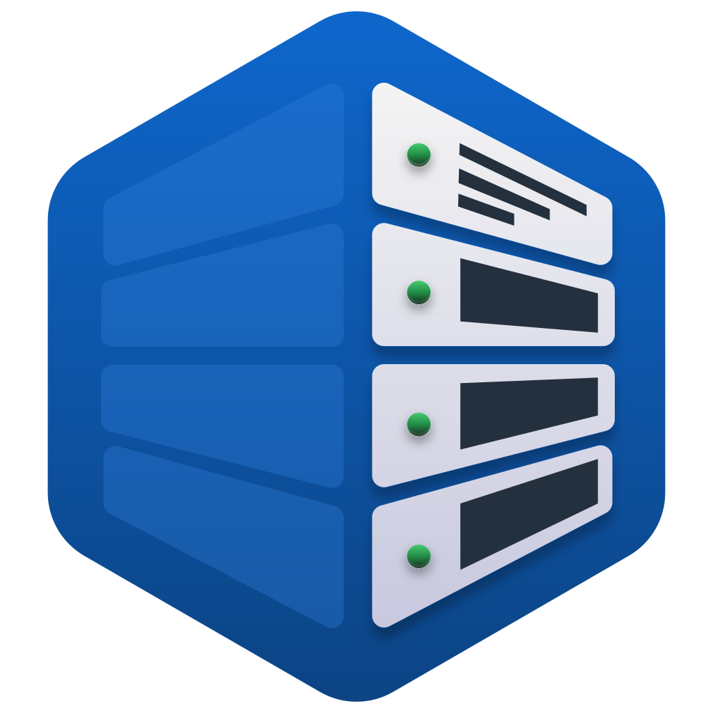

<p align="center">
  
</p>

<h1 align="center">College Server Schedule</h1>

<p align="center">
  <strong>Mobile class schedule for Odessa College Server</strong><br/>
  student &amp; teacher views · Excel sync · offline cache · Firebase Remote Config
</p>

<p align="center">
  
  
  
  
  
  
</p>

<p align="center">
  <a href="#quick-start">Quick Start</a> ·
  <a href="#architecture">Architecture</a> ·
  <a href="PRODUCTION_CHECKLIST.md">Production Guide</a>
</p>

---

## About

**College Server Schedule** (*Коледж Сервер Розклад*) is a production-oriented **React Native** app for [Odessa College Server](https://stud.server.odessa.ua/) students and teachers. It fetches the official `.xlsx` timetable from the college website, parses it on-device, and presents a fast daily view with offline support and a Ukrainian UI.

Key capabilities:

- Daily schedule with weekday tabs (opens on today)
- Browse by **student group** or **teacher name**
- First-run onboarding with persisted favorites
- HTML link discovery → Excel download → SheetJS parsing
- Cache-first sync with URL-based invalidation
- Pull-to-refresh and fresh/offline status badge
- Teacher emoji map via **Firebase Remote Config** (no app update)
- Sandbox-only local storage (no external storage permissions)
- **EAS Build** pipeline for Google Play (AAB)

> Unofficial companion app — not affiliated with Odessa College Server.

---

## Features

| Module | Highlights |
|--------|------------|
| **ScheduleScreen** | Tab view by weekday, pull-to-refresh, student/teacher mode switch, group picker |
| **OnboardingScreen** | Two-step flow: pick role → pick default group or teacher |
| **parser.ts** | Finds latest `.xlsx` on the upload page, normalizes merged teacher/room cells |
| **scheduleService** | Local JSON cache, metadata, network sync, offline fallback |
| **favoritesService** | Persists onboarding choice in app sandbox |
| **LessonItem** | Color-coded lessons, expandable subjects, teacher emojis |
| **firebaseConfig** | Remote Config bootstrap; `teacher_emojis_map` JSON parameter |

---

## Architecture

```
                    +---------------------------+
                    |  stud.server.odessa.ua    |
                    |  WordPress uploads page   |
                    +-------------+-------------+
                                  |
                         HTML + .xlsx URL
                                  |
                                  v
                           +-------------+
                           |  parser.ts  |
                           |  SheetJS    |
                           +------+------+
                                  |
                                  v
                    +-------------+-------------+
                    |     scheduleService       |
                    |  cache · sync · status    |
                    +------+--------------+-----+
                           |              |
                     JSON files      ScheduleScreen
                  (document dir)    TabView · refresh
                           |              |
                           |         +----+----+
                           |         |         |
                           v         v         v
                    +-----------+  DayScene  GroupPicker
                    | favorites |  LessonItem  StatusBadge
                    |  Service  |
                    +-----------+

                    +---------------------------+
                    |  Firebase Remote Config   |
                    |  teacher_emojis_map       |
                    +-------------+-------------+
                                  |
                                  v
                         TeacherEmojisContext
```

### Sync flow

1. Build the current month upload URL on `stud.server.odessa.ua`
2. Parse HTML and extract the latest Excel file link
3. Compare URL with cached metadata — skip download if unchanged
4. Parse workbook into a 2D grid; forward-fill teacher/room only when a subject exists
5. Save schedule + metadata under `FileSystem.documentDirectory`

### Project layout

```
college-server-mobile-app/
├── App.tsx                    # Fonts, Firebase init, providers
├── parser.ts                  # Excel link discovery & parsing
├── screens/
│   ├── ScheduleScreen.tsx     # Main UI: tabs, refresh, modes
│   └── OnboardingScreen.tsx   # First-run setup
├── components/
│   ├── DayScheduleScene.tsx
│   ├── GroupPicker.tsx
│   ├── LessonItem.tsx
│   └── ScheduleStatusBadge.tsx
├── services/
│   ├── scheduleService.ts     # Cache & sync
│   ├── favoritesService.ts    # Onboarding prefs
│   └── firebaseConfig.ts      # Remote Config
├── contexts/
│   └── TeacherEmojisContext.tsx
├── constants/                 # UI tokens, days, time slots
├── assets/                    # Icon, fonts (e-Ukraine)
├── android/                   # Native Android (Expo prebuild)
├── scripts/                   # Icon generation
├── eas.json                   # EAS build profiles
└── PRODUCTION_CHECKLIST.md    # Play Console & release steps
```

---

## Tech Stack

| Layer | Technologies |
|-------|--------------|
| **Mobile** | React Native 0.79, Expo SDK 53, React 19, TypeScript |
| **UI** | react-native-tab-view, react-native-pager-view, custom e-Ukraine fonts |
| **Data** | SheetJS (xlsx), `fetch`, expo-file-system |
| **Remote content** | @react-native-firebase/app, Remote Config |
| **Release** | EAS Build & Submit, Google Play (AAB), New Architecture enabled |

---

## Quick Start

### Prerequisites

- Node.js **18+**
- Android Studio or a physical Android device (for `expo run:android`)
- [Expo account](https://expo.dev/signup) (for production builds only)

### 1. Clone & install

```bash
git clone https://github.com/Yevhen-Lytvynenko/college-server-mobile-app.git
cd college-server-mobile-app
npm install
```

### 2. Run the app

```bash
npm start          # Expo dev server
npm run android    # Android native build (port 8082)
npm run ios        # iOS (macOS only)
```

| Command | Description |
|---------|-------------|
| `npm start` | Start Expo dev server |
| `npm run android` | Run on Android emulator or device |
| `npm run ios` | Run on iOS simulator (macOS) |
| `npm run web` | Expo web preview |
| `npm run generate-icon` | Regenerate icon + sync Android mipmaps |

### 3. Firebase (optional — teacher emojis)

1. Create a Firebase project and register Android app `com.yevhen_lytvynenko.schedule`
2. Download `google-services.json` → place in the **project root**
3. Add Remote Config parameter `teacher_emojis_map` — JSON map of teacher name → emoji

The app runs without Firebase; emoji mapping stays empty until configured.

---

## Environment & config

<details>
<summary><b>Firebase</b> — <code>google-services.json</code> (project root)</summary>

| Item | Description |
|------|-------------|
| `google-services.json` | Android Firebase config (not committed to repo) |
| Remote Config key | `teacher_emojis_map` — e.g. `{"Іванов І.І.": "📐"}` |
| Fetch interval | 30s in dev · 1h in production |

</details>

<details>
<summary><b>Expo / Android</b> — <code>app.json</code></summary>

| Field | Value |
|-------|-------|
| Package | `com.yevhen_lytvynenko.schedule` |
| `newArchEnabled` | `true` |
| Storage | App sandbox only (`blockedPermissions` for external storage) |
| `googleServicesFile` | `./google-services.json` |

</details>

---

## Production build

From the repository root:

```bash
npm install -g eas-cli   # or: npx eas-cli
eas login
npm run build:android:prod
```

Submit to Google Play after the first successful build:

```bash
npm run submit:android:prod
```

Full release checklist (Play Console, permissions audit, versioning): **[PRODUCTION_CHECKLIST.md](./PRODUCTION_CHECKLIST.md)**.

---

## Design decisions

| Decision | Rationale |
|----------|-----------|
| Cache-first loading | Instant UI on cold start; network sync in background |
| URL-based invalidation | Re-download only when the college publishes a new file |
| On-device Excel parsing | No backend to maintain; works with official source as-is |
| Remote Config for emojis | Content tweaks without a store release |
| Sandbox storage | Minimal Android permissions; data stays in app directory |

---

## Screenshots

<!-- Uncomment after adding PNGs to docs/screenshots/ -->
<!--
<p align="center">
  
  
</p>
-->

---

## License

Built for **portfolio and educational purposes**. Schedule data and college branding belong to their respective owners. Commercial reuse requires separate review.

---

<p align="center">
  <sub>College Server Schedule · Yevhen Lytvynenko</sub>
</p>
